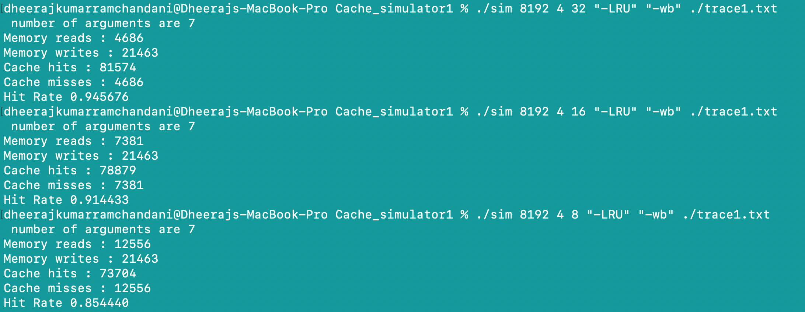

# Cache-Simulator
This is a cache simulator written in C which takes as input the memory trace file.  The Simulator currently implements only the LRU eviction policy and further policies will be further added in future. 

Takes in the followig parameters 
1: cache size 
2: Associativity 
3: block size 
4: eviction policy 
5: write policy 

there are further checked for proper values and for power of 2 and then proceeded and the trace file is given and it should have the format which is specified   EIP  R/W   memory address.  if you have a different format for the file a differnt function for that specific format can be plugged in.

commands to run the code 

1: make clean 

2: make sim 

3:./sim cache_size,  associativity,  block_size,  eviction_policy, write_policy , trace file

 <b> Sample output shown </b> 

 <h4> output</h4>
  

